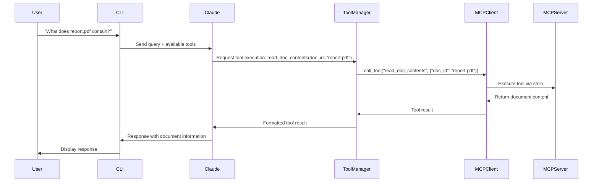
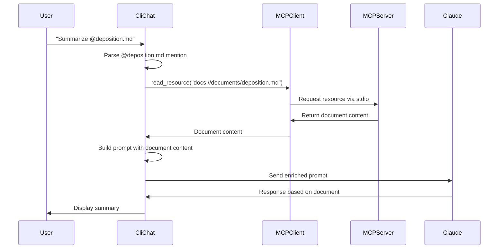
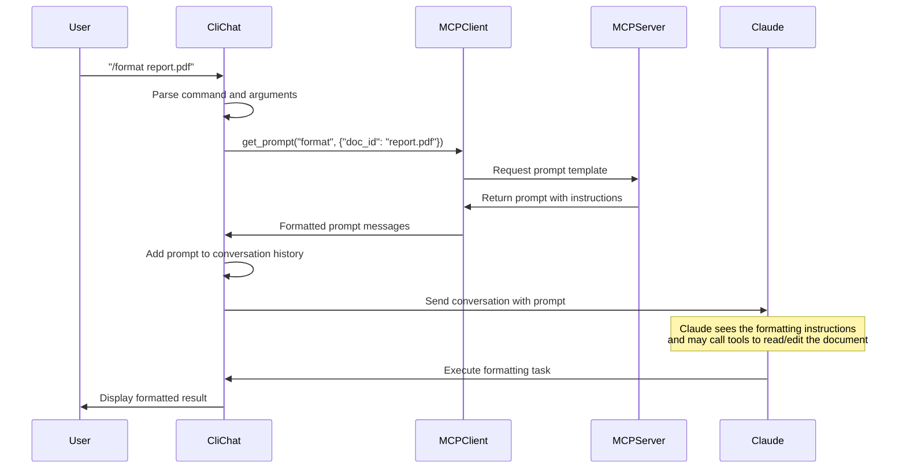

# MCP Chat

MCP Chat is a command-line interface application that enables interactive chat capabilities with AI models through the Anthropic API. The application supports document retrieval, command-based prompts, and extensible tool integrations via the MCP (Model Control Protocol) architecture.

**Note**: This project requires [uv](https://github.com/astral-sh/uv) for package management and execution. Traditional pip/python setups are not supported.

**Source**: This is the original code from Anthropic's MCP Introduction Course at: https://anthropic.skilljar.com/introduction-to-model-context-protocol

**Enhancements**: We have added educational code comments throughout the codebase and generated comprehensive training materials in the `docs/` folder to help developers learn MCP concepts.

**Course Notes**: The original course notes are in [anthropic_mcp_course_notes.md](anthropic_mcp_course_notes.md)

**Training Materials**: See `docs/` folder for auto-generated educational slides and presentations

## Prerequisites

- Python 3.9+
- Anthropic API Key

## Setup

### Step 1: Configure the environment variables

1. Copy the environment template and configure your API key:

```bash
cp .env.dist .env
```

2. Edit the `.env` file and add your Anthropic API key:

```
ANTHROPIC_API_KEY=""  # Enter your Anthropic API secret key
CLAUDE_MODEL=""       # Enter your Claude model (e.g., claude-3-sonnet-20240229)
```

### Proxy Configuration (Optional)

If you're behind a corporate proxy (e.g., Zscaler), add these settings to your `.env` file:

```
HTTP_PROXY=http://127.0.0.1:9000
HTTPS_PROXY=http://127.0.0.1:9000
NO_PROXY=localhost,127.0.0.1,.local

# SSL Configuration for corporate proxies
# Set to false if you're having SSL certificate issues with corporate proxies
VERIFY_SSL=false
```

The application will automatically detect and configure proxy settings when these environment variables are present.

### Step 2: Install dependencies

This project requires [uv](https://github.com/astral-sh/uv) for package management and running.

1. [Install uv](https://github.com/astral-sh/uv?tab=readme-ov-file#installation), if not already installed

2. Install dependencies:

```bash
uv sync
```

3. Run the project:

```bash
uv run main.py
```

## Usage

### Basic Interaction

Simply type your message and press Enter to chat with the model.

### Document Retrieval

Use the @ symbol followed by a document ID to include document content in your query:

```
> Tell me about @deposition.md
```

### Commands

Use the / prefix to execute commands defined in the MCP server:

```
> /summarize deposition.md
```

Commands will auto-complete when you press Tab.

## Educational Resources

### Training Materials
The `docs/` folder contains comprehensive educational materials:

- **`mcp-education-slides.md`**: Complete slide deck covering MCP concepts with speaker notes
- **`mcp-education-slides.html`**: Rendered HTML version of the slides

### Code Comments
The entire codebase has been enhanced with educational comments explaining:
- MCP architecture and design patterns
- Async programming patterns in Python
- Tool, resource, and prompt implementations
- Client-server communication flows
- Real-world development considerations

### Documentation
- **`CLAUDE.md`**: Developer guide for working with this codebase
- **`core/README.md`**: Explanation of the core module architecture
- **`anthropic_mcp_course_notes.md`**: Original course notes from Anthropic

## MCP Interaction Flows

The following diagrams illustrate how different types of MCP interactions work within the application:

### Tool Usage Flow

When Claude needs to call a tool (like reading a document):



### Resource Access Flow

When a user mentions a document with @ syntax:



### Prompt Execution Flow

When a user executes a command with / syntax:



## Development

### Adding New Documents

Edit the `mcp_servers/documents_mcp_server.py` file to add new documents to the `docs` dictionary.

### Implementing MCP Features

To fully implement the MCP features:

1. Complete the TODOs in `mcp_servers/documents_mcp_server.py`
2. Implement the missing functionality in `mcp_client.py`

### Linting and Typing Check

There are no lint or type checks implemented.
