# MCP Learning Demo

MCP Learning Demo is a comprehensive application that enables interactive chat capabilities with AI models through the Anthropic API. It provides both **console** and **web** interfaces, supporting document retrieval, command-based prompts, and extensible tool integrations via the MCP (Model Context Protocol) architecture.


**Note**: This project requires [uv](https://github.com/astral-sh/uv) for package management and execution. Traditional pip/python setups are not supported.

## Architecture Overview

This application demonstrates a flexible, modular MCP architecture with multiple clients and servers:

### Architecture Components
- **`mcp_servers/`** - Modular MCP servers providing different capabilities (documents, calculator, etc.)
- **`mcp_clients/`** - Pluggable MCP client implementations for different transport types (stdio, HTTP)
- **`core/`** - Core application logic for chat interface, Claude API integration, and tool management
- **`web/`** - Web-based chat interface with full MCP observability
- **`web_server.py`** - HTTP server providing Claude API proxy and static file serving

### Key Features
- **Multiple Interfaces**: Both console (CLI) and web-based chat interfaces
- **Transport Flexibility**: stdio transport for local development, HTTP transport for web/remote
- **Auto-discovery** - Automatically loads all available servers when no specific servers are specified
- **Multi-server composition** - Claude can use tools from multiple servers in a single response
- **Full Observability** - Web interface shows all MCP communications in real-time

## Prerequisites

- Python 3.9+
- Anthropic API Key

## Setup

### Step 1: Configure the environment variables

1. Copy the environment template and configure your API key:

```bash
cp .env.dist .env
```

2. Edit the `.env` file and add your Anthropic API key:

```
ANTHROPIC_API_KEY=""  # Enter your Anthropic API secret key
CLAUDE_MODEL=""       # Enter your Claude model (e.g., claude-3-sonnet-20240229)
```

### Proxy Configuration (Optional)

If you're behind a corporate proxy (e.g., Zscaler), add the appropriate settings to your `.env` file:

```
HTTP_PROXY=http://127.0.0.1:9000
HTTPS_PROXY=http://127.0.0.1:9000
NO_PROXY=localhost,127.0.0.1,.local

# SSL Configuration for corporate proxies
# Set to false if you're having SSL certificate issues with corporate proxies
VERIFY_SSL=false
```

The application will automatically detect and configure proxy settings when these environment variables are present.

### Step 2: Install dependencies

This project requires [uv](https://github.com/astral-sh/uv) for package management and running.

1. [Install uv](https://github.com/astral-sh/uv?tab=readme-ov-file#installation), if not already installed

2. Install dependencies:

```bash
uv sync
```

3. Run the project:

```bash
uv run main.py
```

### Running with Multiple MCP Servers

The application supports flexible MCP server loading:

**Auto-Discovery (Default):**
```bash
# Automatically loads all *mcp_server.py files in mcp_servers/
uv run main.py
```

**Manual Selection:**
```bash
# Load specific servers only
uv run main.py mcp_servers/calculator_mcp_server.py
uv run main.py mcp_servers/documents_mcp_server.py

# Multiple specific servers
uv run main.py mcp_servers/calculator_mcp_server.py mcp_servers/weather_mcp_server.py
```

The application will display which servers are loaded at startup.

## Usage

The MCP Learning Demo supports two interface modes:

### Console Mode (Default)
Run the traditional command-line interface:
```bash
# Auto-discover all available MCP servers
uv run main.py

# Use specific servers
uv run main.py mcp_servers/calculator_mcp_server.py mcp_servers/documents_mcp_server.py
```

### Web Mode
Run the web-based chat interface with full MCP observability:
```bash
# Auto-discover all available MCP servers  
uv run main.py --web

# Use specific servers
uv run main.py --web mcp_servers/calculator_mcp_server.py
```

Then open your browser to: **http://localhost:8000**

The web interface provides:
- **Split-panel design**: Chat on the left, MCP communication log on the right
- **Real-time observability**: See all MCP protocol messages as they happen  
- **Tool execution visualization**: Watch Claude use tools to answer questions
- **Responsive design**: Works on desktop and mobile devices


## MCP Interaction Flows

The following diagrams illustrate how different types of MCP interactions work within the application:

### Multi-Server Architecture Flow

How the application loads and coordinates multiple MCP servers:


### Tool Usage Flow

When Claude needs to call a tool (from any loaded server):

```mermaid
sequenceDiagram
    participant User
    participant CLI
    participant Claude
    participant ToolManager
    participant MCPClient
    participant MCPServer

    User->>CLI: "Calculate 25 + 17 and read report.pdf"
    CLI->>Claude: Send query + available tools from all servers
    Note over Claude: Claude decides which tools to use
    Claude->>ToolManager: Request tool: add(25, 17)
    ToolManager->>MCPClient: call_tool("add") → Calculator Server
    MCPClient->>MCPServer: Execute calculation
    MCPServer->>MCPClient: Result: 42
    MCPClient->>ToolManager: Tool result
    Claude->>ToolManager: Request tool: read_doc_contents("report.pdf")
    ToolManager->>MCPClient: call_tool("read_doc_contents") → Documents Server
    MCPClient->>MCPServer: Execute document read
    MCPServer->>MCPClient: Return document content
    MCPClient->>ToolManager: Tool result
    ToolManager->>Claude: Combined tool results
    Claude->>CLI: Response combining calculation and document info
    CLI->>User: Display integrated response
```


